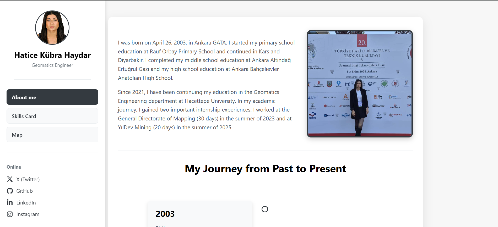

# 🌍 Hatice Kübra Haydar – Personal Web Page

This repository contains my personal digital CV website created for **GMT458 - Web GIS (Assignment 1)** at Hacettepe University.

🔗 **Live Website:** [https://kubrahydar.github.io/personal-web-page-kubrahyar/](https://kubrahydar.github.io/personal-web-page-kubrahyar/)

---

## 🖥️ Website Overview

My website introduces my **educational background, technical skills, and mapping experience** as a Geomatics Engineering student.

It consists of three main sections:

### 🧩 Pages
- **About Me:** A short biography including education and internships.  
- **Skills Card:** My professional and technical abilities represented with images, progress bars, and animation.  
- **Map:** An interactive **OpenLayers map** showing my educational and professional locations.

---

## 🧠 Technologies Used

- **HTML5 & CSS3** — for structure and styling  
- **Font Awesome** — for social media icons  
- **OpenLayers 8.2.0** — for map visualization  
- **GitHub Pages** — for hosting the live website  

---

## 🧩 Features

- Clean and responsive layout  
- Interactive map with coordinates, popups, and filters  
- Skill cards with images and animation effects  
- Organized sidebar navigation with working social links  

---

## 🤖 AI Usage Statement

During the development process, I used **ChatGPT (GPT-5)** mainly as a **learning and debugging assistant**.  
Here are the specific tasks where I benefited from AI support:

- Helped me **design CSS animations** for skill cards and improve their transition effects.  
- Assisted in **color palette selection** to ensure a professional and readable layout.  
- Supported me in **debugging HTML/CSS structure issues** and fixing display problems (e.g., image size, sidebar layout).  
- Helped correct small syntax and linking errors in the **OpenLayers map** section.  
- Provided suggestions for improving overall website organization and readability.  
- Assisted in writing the **README.md** file in clear and structured English.

**Total estimated AI usage:** Approximately **3 hours** in total.  

---

📍 **Created by:** Hatice Kübra Haydar  
🎓 **Department:** Geomatics Engineering – Hacettepe University  
